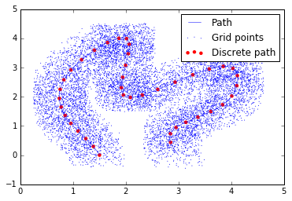
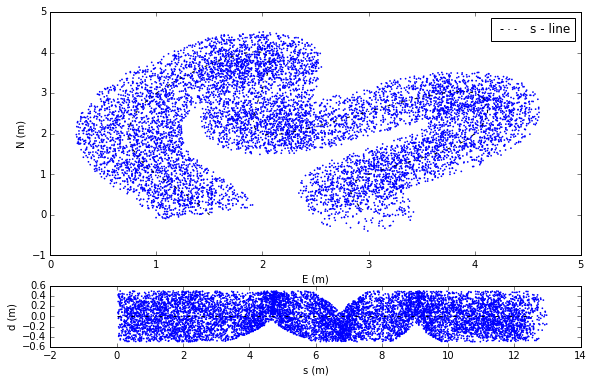
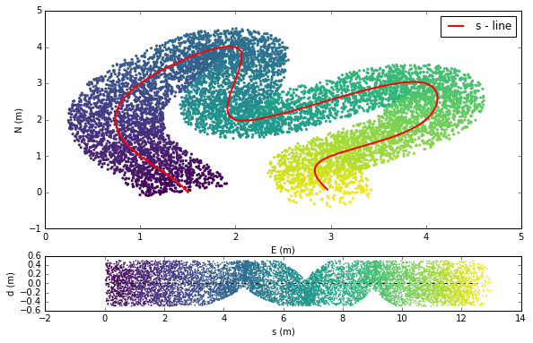

AnisotroPy
=======

Anisotropic Transformation for Python.

The code suport anisotropic coordinate transformation over metric coordinate systems.
The implementation details are available in Guarneri (2017).

AnisotroPy is the base for the Qgis Plug-in, further details are available in https://github.com/henriqueguarneri/qgis-anyform-plugin. 

AnisotroPy uses the BSD 3-Clause License.

Anitropic Transformation Example
^^^^^^^^^^^^^^^^^^^^^^^^

A small example script showing the usage of the AnyForm transformation.

.. code:: python

    from anisotroPy import basegrid, basepath, transformation
    import numpy as np
    import matplotlib.pyplot as plt
    from __future__ import division
    import numpy as np
    import scipy.interpolate
    import pandas as pd

.. code:: python

    # Input values creation
    x = np.array([ 1.5,  1.,  1.,  2.,  2.,  4.,  4.,  3., 3.])
    y = np.array([ 0.,  1.,  3.,  4.,  2.,  3.,  2.,  1., 0.])
    
    t = np.zeros(x.shape)
    t[1:] = np.sqrt((x[1:] - x[:-1])**2 + (y[1:] - y[:-1])**2)
    t = np.cumsum(t)
    t /= t[-1]
    nt = np.linspace(0, 1, 10000)
    x1 = scipy.interpolate.spline(t, x, nt)
    y1 = scipy.interpolate.spline(t, y, nt)
    plt.plot(x1, y1, label='Path',lw=0.5)
    
    random_x = np.random.random(len(x1))
    random_y = np.random.random(len(y1))
    
    plt.scatter(x1+random_x-0.5,y1+random_y-0.5,s=1,edgecolors='none', label = 'Grid points')
    plt.scatter(x1[::250], y1[::250], label='Discrete path', c = 'r',edgecolors='none')
    plt.legend(loc='best')
    plt.show()

.. code:: python

    # Set grid
    grid = zip(x1+random_x-0.5,y1+random_y-0.5)

.. code:: python
	
    # Set path
    path = zip(x1[::40],y1[::40])

.. code:: python

    #   Create basepath object and load data from a dataframe.
    bp  = basepath.Basepath()
    bp.basepath = pd.DataFrame()
    bp.basepath['E'] = zip(*path)[0]
    bp.basepath['N'] = zip(*path)[1]
    #   Calculate the s distances from the origin,
    #   the bc distance between every consecutive points
    #   and the vector between bc
    bp.calculate_s()
    bp.calculate_bc()
    bp.calculate_vbc()
    #   Create basegrid object and load data from a csv file.
    bg  = basegrid.Basegrid()
    bg.basegrid = pd.DataFrame()
    bg.basegrid['E'] = zip(*grid)[0]
    bg.basegrid['N'] = zip(*grid)[1]
    #   Create transformation object, with default configuration
    #   and with the basepath and basegrid objects.
    trg = transformation.Transformation(bp, bg, msp=0.5, st = 0.0001)
    #   Perform the transformation.
    trg.run()
    #   Save the transformed basegrid to a csv file.
    #bg.basegrid.to_csv('bathymetry_out.csv', sep='\s')

.. parsed-literal::

    0:00:17.498240

.. code:: python

    import matplotlib.gridspec as gridspec
    
    def plot_width(df,buff=100):
        return (df.d.astype('float')>-buff)&(df.d.astype('float')<buff)
    
    fig = plt.figure(figsize=(9.5,6))
    gs = gridspec.GridSpec(2,1,height_ratios=[4,1])
    
    ax0 = plt.subplot(gs[0])
    p0 = plt.scatter(
                    bg.basegrid.E[plot_width(bg.basegrid)].tolist(),
                    bg.basegrid.N[plot_width(bg.basegrid)].tolist(),
                    c = bg.basegrid.s[plot_width(bg.basegrid)].tolist(),
                    cmap='viridis',
                    s=10,
                    edgecolors='none',
                    )
    p01 = plt.plot(
                    bp.basepath.E,
                    bp.basepath.N,
                    'red',
                    ls='-',
                    lw=2,
                    label='s - line')
    plt.legend()
    ax0.set_xlabel('E (m)')
    ax0.set_ylabel('N (m)')
    
    ax1 = plt.subplot(gs[1])
    p0 = plt.scatter(
                    bg.basegrid.s[plot_width(bg.basegrid)].tolist(),
                    bg.basegrid.d[plot_width(bg.basegrid)].tolist(),
                    c = bg.basegrid.s[plot_width(bg.basegrid)].tolist(),
                    cmap='viridis',
                    s=3,
                    edgecolors='none',
                    )
    plt.plot([0,bp.basepath.Dist.max()],[0,0],'black',ls='-.',lw=1)
    ax1.set_xlabel('s (m)')
    ax1.set_ylabel('d (m)')
    plt.show()

References
^^^^^^^^^^^^^^^^^^^^^^^^

Guarneri, H. (2017) Methods for the Analysis and Design of Inland Waterways and Application for the Paraguay River Waterway. Master Dissertation. Federal University of Paraná.